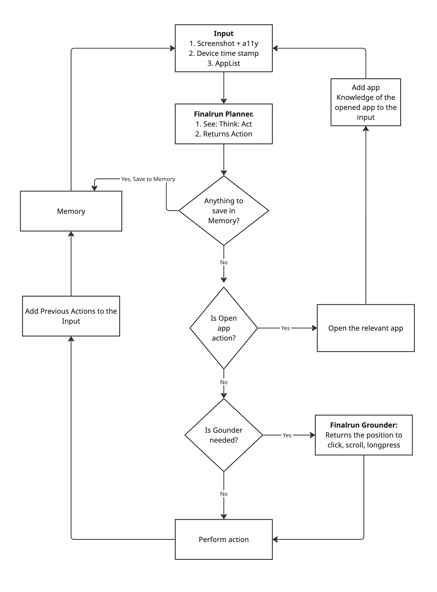

## Finalrun Agentic Approach

FinalRun agent operates like a human expert, not a blind script. Its core philosophy is to be **goal-oriented and state-aware**, meaning its primary objective is to ensure the device is in the final state requested by the user, and it constantly checks the screen to see if that state has already been achieved.

This approach is built on three key components:

**1. The `See, Think, Act` Cognitive Loop:**
This is the agent's "brain" for every single step it takes.
*   **See:** First, it observes the critical elements on the screen.
*   **Think:** It analyzes what it sees to form a plan. It considers multiple sources of information: its own memory, its action history, and crucially, any provided **App Knowledge**.
*   **Act:** Before executing any action, it applies an **intelligent wait** to ensure the UI is ready and stable—a small but powerful detail that prevents timing issues. Then it executes the single best action (e.g., `click`, `swipe`, `input_text`) based on its comprehensive analysis.

**2. The Critical Memory Protocol:**
This is the agent's "smart short-term memory" for handling complex, multi-step tasks. The rule is simple: **before performing an action that will change the screen, it remembers any essential information it might need later.**
*   **Example:** When copying a verification code from an SMS to an app, it *remembers the code* before navigating away from the SMS app. This prevents data loss and ensures perfect accuracy.

**3. Strategic Task Handling:**
The agent doesn't treat all tasks the same. In its "Think" phase, it identifies the *type* of goal it's working on and applies the best strategy for it.
*   **For Data Transfer:** It uses the Memory Protocol to ensure 100% accuracy.
*   **For State Changes (like deleting items):** It acts first, then uses its memory to keep track of what it has already "fixed."
*   **For Q&A:** It focuses on finding the answer and reporting it directly.

**Why This Approach is Effective:**

*   **Efficient:** By constantly checking the state and leveraging App Knowledge, it never performs redundant actions and always looks for the smartest paths.
*   **Accurate:** The memory protocol guarantees that data is transferred verbatim without errors.
*   **Robust:** Because it re-evaluates the screen at every step, it can adapt to unexpected pop-ups or UI changes without failing.

## Examples (from Android World)

See how the FinalRun agent handles real-world tasks with its `See, Think, Act` approach. Each example is taken Android World task, includes a video demonstration and the detailed steps showing the agent's thought process.

### Example 1: Basic Audio Recording
**Task:** *Record an audio clip using Audio Recorder app and save it*  

*Click to watch video ↑*

**Steps Taken:**
1. **Open Audio Recorder** - Navigates from home screen to the Audio Recorder app
2. **Get Started** - Taps through the welcome screen 
3. **Apply Settings** - Proceeds past the setup screen to reach recording interface
4. **Start Recording** - Taps the circular record button to begin recording
5. **Stop Recording** - Ends the recording to trigger the save dialog
6. **Remember & Save** - **Critical:** Memorizes "Record-1" filename before saving (Memory Protocol in action!)
7. **Report Answer** - Provides the exact saved filename: "Record-1.m4a"

*Key Insight: Notice how the agent remembers the filename BEFORE tapping save—preventing data loss if the dialog closes.*

### Example 2: Audio Recording with Custom Filename  
**Task:** *Record audio and save with name "presentation_fGwr.m4a"*  

*Click to watch video ↑*

**Steps Taken:**
1. **Open Audio Recorder** - Launches the app from home screen
2. **Navigate Setup** - Bypasses welcome and setup screens
3. **Dismiss Warning** - Handles unexpected "records deleted" popup gracefully
4. **Start Recording** - Initiates audio recording
5. **Stop Recording** - Ends recording to open save dialog
6. **Enter Custom Name** - Clears default text and types "presentation_fGwr.m4a"
7. **Save Recording** - Confirms save with the specified filename

*Key Insight: The agent adapts to unexpected popups and accurately enters the exact filename requested.*

### Example 3: Interactive Maze Navigation
**Task:** *Open task.html from Downloads in file manager, open with Chrome, navigate X to bottom-right using direction buttons*  

*Click to watch video ↑*

**Steps Taken:**
1. **Open Files App** - Navigates to file manager
2. **Select task.html** - Taps the file in Downloads folder
3. **Choose Chrome** - Selects "Just once" to open with Chrome
4. **Bypass Sign-in** - Strategically uses "Use without an account" to skip Chrome login
5. **Handle Redirects** - When accidentally entering sign-in flow, backs out and retries
6. **Wait for Page Load** - Intelligently waits for the maze game to render
7. **Navigate Maze** - Executes calculated path: Right → Down → Down → Right → Right → Down
   - Avoids black obstacle cells
   - Plans efficient route to green target
   - Makes 6 precise directional moves

*Key Insight: The agent handles multi-app workflows, unexpected Chrome prompts, and solves the maze puzzle strategically.*

### Example 4: Web Drawing Application
**Task:** *Open task.html in Chrome and create a drawing using three specific colors (teal, magenta, dark navy)*  

*Click to watch video ↑*

**Steps Taken:**
1. **Open Files App** - Starts from home screen
2. **Select HTML File** - Taps task.html in Downloads
3. **Launch in Chrome** - Chooses Chrome with "Just once"
4. **Chrome Setup** - Accepts terms, declines sync ("No thanks")
5. **Re-open File** - Returns to Files app after Chrome setup, reopens task.html
6. **Select Teal Color** - Picks teal from color palette (row 2, position 4)
7. **Draw Teal Stroke** - Makes diagonal swipe on canvas
8. **Select Magenta** - Switches to magenta color (row 1, position 5)
9. **Draw Magenta Stroke** - Creates crossing diagonal line
10. **Select Dark Navy** - Chooses final required color (row 2, position 1)
11. **Draw Navy Stroke** - Adds horizontal stroke
12. **Submit Drawing** - Taps Submit button to complete task

*Key Insight: The agent precisely identifies color positions in the palette and creates distinct strokes with each required color.*

### How the Agent Thinks

Each step demonstrates the core approach:
- **See:** Observes current screen state and available elements
- **Think:** Analyzes the goal, considers app knowledge, checks memory for critical data
- **Act:** Executes the single best action with intelligent timing

The agent never blindly follows a script—it continuously evaluates the screen state and adapts to unexpected situations like popups, redirects, or UI changes. This state-aware, goal-oriented approach ensures reliable task completion across diverse Android scenarios.